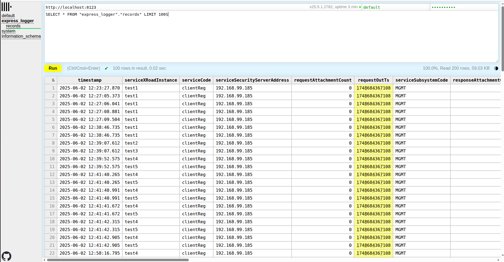
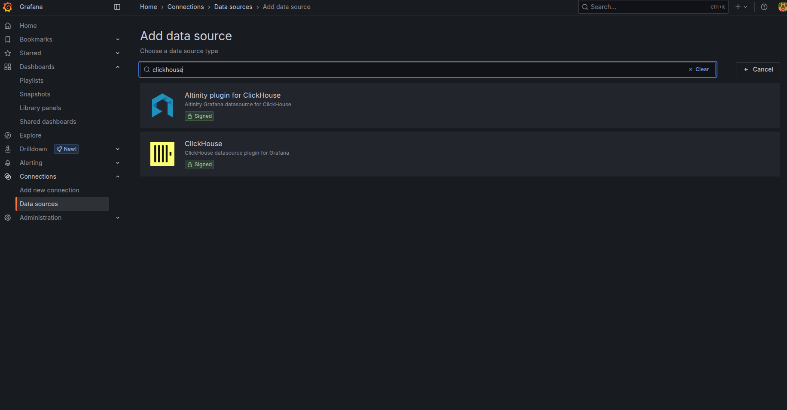
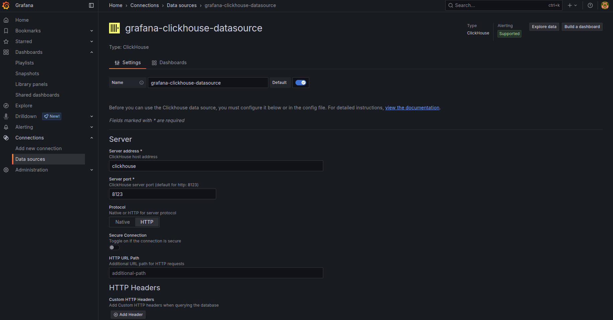
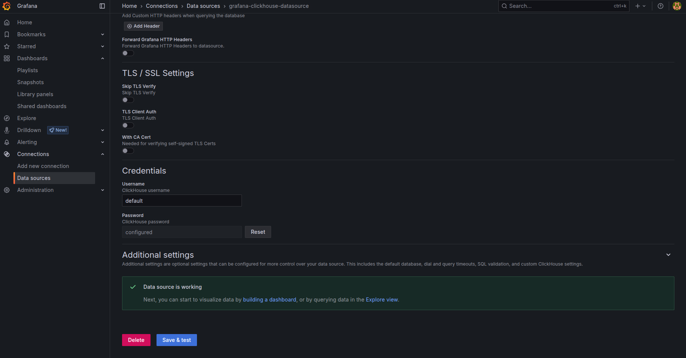
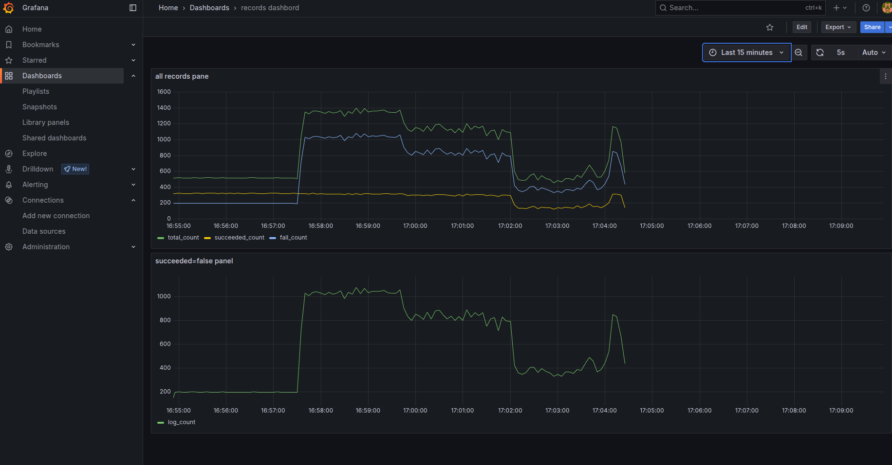

# ClickHouse Express Logger

## About

This project provides a simple logging API implementation that works with
ClickHouse. It includes Docker Compose configuration for ClickHouse, making it
easy to set up a complete logging environment.

## Requirements

- Node.js
- npm
- Docker and Docker Compose

## Getting Started

Make sure Docker is running before starting the application:

```bash
# Install dependencies
npm install

# Start ClickHouse and Grafana containers
docker-compose up -d

# Start the server
npm start
```

The server will:

- Start on port 4000
- Connect to ClickHouse
- Create the necessary database and table if they don't exist
- Save incoming HTTP POST requests to ClickHouse

## Testing

To test the logger functionality:

1. Open a second terminal to populate the database by sending a POST request to
   the API with body data from requestExample:

   ```bash
   npm run post
   ```

   Or send POST requests to <http://localhost:4000/record> manually using any
   of these methods:

   - Using curl
   - Using Postman

   Example request body format (from `requestExample.js`):

   ```javascript
   {
     "records": [
       {
         "serviceXRoadInstance": "test1",
         "serviceCode": "clientReg",
         "serviceSecurityServerAddress": "192.168.99.185",
         "requestAttachmentCount": 0,
         "requestOutTs": 1748684367108,
         "serviceSubsystemCode": "MGMT",
         "responseAttachmentCount": 0,
         "clientMemberCode": "00000089",
         "requestType": "SOAP",
         "responseInTs": 1748684368473,
         "messageProtocolVersion": "4.0",
         "messageId": "ae6da682-ccf5-4d65-b13b-7a67b833d131",
         "clientXRoadInstance": "test1",
         "clientMemberClass": "GOV",
         "serviceMemberCode": "00000001",
         "transactionId": "24b6d06c-3e03-11f0-a847-c3ae802a6ac1",
         "securityServerType": "Client",
         "securityServerInternalIp": "192.168.99.203",
         "serviceMemberClass": "GOV",
         "requestInTs": 1748684367043,
         "clientSecurityServerAddress": "192.168.99.203",
         "requestSoapSize": 1285,
         "responseOutTs": 1748684368630,
         "responseSoapSize": 1522,
         "succeeded": true
       }
     ]
   }
   ```

2. You should receive a response with 'OK' for each request.

3. Now you should be able to see saved request data in the database.

### Option 1: Via ClickHouse Query Interface

1. Go to <http://localhost:8123/play>
2. Enter password "clickhouse"
3. Run these queries:

   Query for first 100 records:

   ```sql
   SELECT * FROM "express_logger"."records" LIMIT 100
   ```

   Query to get records count:

   ```sql
   SELECT count(*) FROM "express_logger"."records"
   ```

   

### Option 2: Via Configurable Grafana Dashboard

The project includes Grafana dashboard configuration for visualizing ClickHouse
data. Follow these steps to set up Grafana dashboards:

1. Access the Grafana web interface at <http://localhost:3000>
2. Log in with the default credentials:
   - Username: `admin`
   - Password: `admin`
3. You'll be prompted to change the password on first login.
4. Go to "Add data source" and download ClickHouse Plugin for Grafana:

   

5. Setup the data source:

   
   

   Click "Save & Test" to verify the connection.

6. Go to Dashboard > Import. Import `grafanaDashboard.json` to use suggested
   panels or create your own:

   

### Managing Docker Containers

```bash
# Start the ClickHouse container
docker-compose up -d

# Check container status
docker ps

# Stop the containers
docker-compose down

# Remove containers and volumes completely
docker-compose down -v
```

<!--
TODO server logging with levels

TODO env -->
